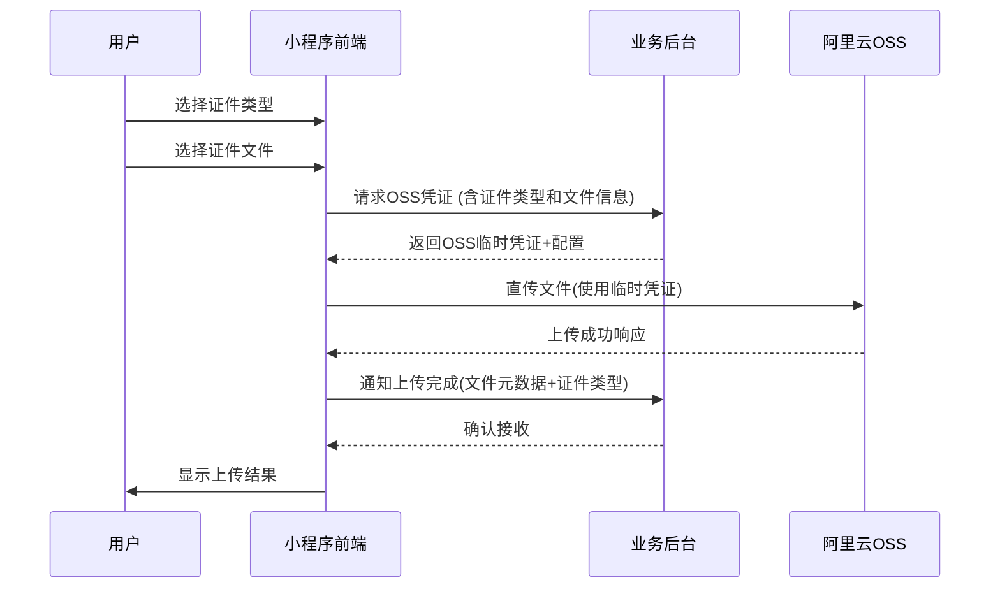

# 旭钦郢票务证件上传系统
软件需求规格说明书

| 文档信息 | 说明 |
|---------|------|
| 文档标题 | 旭钦郢票务证件上传系统软件需求规格说明书 |
| 版本号 | V1.0 |
| 状态 | 正式发布 |
| 发布日期 | 2025-07-01 |
| 文档维护 | 旭钦郢票务技术团队 |
| 系统依赖 | 后台API服务 v1.0 |

## 文档修订历史

| 版本号 | 修订日期 | 修订说明 | 修订人 |
|--------|----------|----------|--------|
| V1.0 | - | 初始版本 | - |

## 目录

- [1. 引言](#1-引言)
  - [1.1 编写目的](#11-编写目的)
  - [1.2 系统定位](#12-系统定位)
  - [1.3 术语表](#13-术语表)
  - [1.4 用户体验](#14-用户体验)
    - [1.4.1 响应式设计](#141-响应式设计)
    - [1.4.2 交互反馈](#142-交互反馈)
    - [1.4.3 视觉设计](#143-视觉设计)
- [2. 系统功能需求](#2-系统功能需求)
  - [2.1 用户认证](#21-用户认证)
  - [2.2 文件上传](#22-文件上传)
  - [2.3 文件管理](#23-文件管理)
  - [2.4 安全机制](#24-安全机制)
- [3. 系统接口规范](#3-系统接口规范)
- [4. 非功能需求](#4-非功能需求)
- [5. 系统架构](#5-系统架构)
  - [5.1 数据存储](#51-数据存储)
  - [5.2 OSS存储结构设计方案](#52-oss存储结构设计方案)
    - [5.2.1 目录结构设计原则](#521-目录结构设计原则)
    - [5.2.2 文件命名规范](#522-文件命名规范)
    - [5.2.3 生命周期策略](#523-生命周期策略)
    - [5.2.4 访问控制策略](#524-访问控制策略)
- [6. 国际化方案](#6-国际化方案)
  - [6.1 语言资源结构](#61-语言资源结构)
- [7. 测试需求](#7-测试需求)
  - [7.1 认证测试](#71-认证测试)
  - [7.2 文件操作测试](#72-文件操作测试)
  - [7.3 语言测试](#73-语言测试)
  - [7.4 提交测试](#74-提交测试)
  - [7.5 性能测试](#75-性能测试)

## 1. 引言

### 1.1 编写目的
本文档旨在详细说明旭钦郢票务证件上传系统的功能需求和技术规范，为系统开发和测试提供依据。

### 1.2 系统定位
证件上传系统是旭钦郢票务公司小程序的核心模块，允许用户上传证件文件（照片或PDF格式）进行核验。支持中英双语界面，提供文件管理功能，并通过用户身份验证确保数据安全。系统采用阿里云OSS作为存储方案，通过后台API进行用户认证和临时凭证管理。

### 1.3 术语表

| 术语 | 说明 |
|------|------|
| OSS | 阿里云对象存储服务 |
| STS | 阿里云临时访问凭证服务 |
| Token | 用户身份验证令牌 |

## 1.4 用户体验

### 1.4.1 响应式设计
- 适配移动设备（≤480px）
- 移动端：上传选项单列显示

### 1.4.2 交互反馈
- 按钮悬停效果
- 操作成功/失败提示
- 加载状态指示

### 1.4.3 视觉设计
- 主色调：深蓝色(#093f74)
- 强调色：橙色(#ea911a)
- 清晰的信息层级结构

## 2. 系统功能需求

### 2.1 用户认证

#### 2.1.1 认证机制
- 用户登录通过后台API验证，不对外开放注册
- 前端传递token或用户标识到后台验证合法性
- 登录状态持久化存储（localStorage）

#### 2.1.2 登出功能
- 清除本地用户凭证
- 通知后台注销会话

### 2.2 文件上传

#### 2.2.1 上传流程

1. 证件类型选择（必选）：

   - 国际护照

   - 港澳通行证

   - 台湾通行证

   - 永久居住证

   - 中国护照


2. 文件上传流程：



#### 2.2.2 文件限制
- 单次最大上传数：20个文件
- 单个文件大小：≤10MB
- 支持格式：图片格式(jpg/png)、PDF

### 2.3 文件管理

#### 2.3.1 文件展示(待定)
- 显示OSS文件名和原始文件名
- 实时展示上传状态和进度
- 支持文件预览（图片/PDF）

### 2.4 安全机制

#### 2.4.1 临时凭证
- 基于阿里云STS服务生成临时访问凭证
- 权限范围：仅允许上传到指定目录
- 凭证有效期：24小时（可配置）


## 3. 系统接口规范

### 3.1 获取OSS凭证
- **接口**：POST /api/get-oss-credentials
- **参数**：
{
  "userId": "123",
  "fileCount": 2,
  "fileTypes": ["image/jpeg", "application/pdf"],
  "documentType": "international_passport" // 新增证件类型字段
}

### 3.2 确认上传
- **接口**：POST /api/confirm-upload
- **参数**：
{
  "userId": "123",
  "documentType": "international_passport", // 新增证件类型字段
  "files": [{
    "ossPath": "user/123/20230630/a1b2c3.jpg",
    "originalName": "id_card.jpg",
    "size": 245760,
    "type": "image/jpeg"
  }]
}

### 3.3 查询上传历史（待定）
- **接口**：GET /api/upload-history
- **参数**：

## 4. 非功能需求

### 4.1 性能需求
- 上传响应时间：≤ ?秒（10MB以内文件）
- 并发支持：<=10用户同时上传(oss默认tps为10)
- 日均上传量：

### 4.2 安全需求
- 所有接口强制HTTPS
- API请求需包含签名验证
- 定期清理过期文件和临时凭证

### 4.3 可用性需求
- 系统可用性：≥99.9%
- 支持断点续传
- 网络异常自动重试

## 5. 系统架构

```
  +------------+       +-------------+       +---------------+
  | 微信小程序  | <---> | 业务后台API  | <---> | 阿里云OSS存储  |
  +------------+       +-------------+       +---------------+
         │                    │
         │                    ├───────────> 阿里云STS服务
         │                    │
         │                    └───────────> 数据库(文件元数据)
         │
         └──────────────────> CDN加速(可选)
```

```

#### 5.2 OSS存储结构设计方案

#### 5.2.1 目录结构设计原则（待定）
基于用户上传的证件文件（包括直接上传的照片和PDF转换后的照片），设计了以下目录结构方案：

```text
旭钦郢票务存储桶/
├── users/
│   ├── {userID}/                  // 按用户ID分区
│   │   ├── documents/             // 原始文档存储
│   │   │   ├── photos/            // 直接上传的照片
│   │   │   │   ├── {date}/        // 按日期分区
│   │   │   │   │   ├── {fileID}.jpg
│   │   │   │   │   └── ...
│   │   │   │   └── ...
│   │   │   └── pdfs/              // 上传的PDF文件
│   │   │       ├── {date}/
│   │   │       │   ├── {fileID}.pdf
│   │   │       │   └── ...
│   │   │       └── ...
│   │   └── converted/             // 转换后的照片存储
│   │       ├── photos/            // 直接上传的照片（原始照片的引用）
│   │       └── pdfs/              // PDF转换后的照片
│   │           ├── {date}/
│   │           │   ├── {originalPDFID}-page1.jpg
│   │           │   ├── {originalPDFID}-page2.jpg
│   │           │   └── ...
│   │           └── ...
│   └── ...
└── temp/                          // 临时上传区域
```

#### 5.2.2 文件命名规范
- 用户ID格式：UID_{8位数字}（示例：UID_10002345）
- 日期格式：YYYYMMDD（示例：20250701）
- 文件ID格式：{时间戳}_{随机数}（示例：1688140800_5a8f7e）
- PDF转换照片命名：{原始PDF文件ID}-page{页码}.jpg（示例：1688140800_5a8f7e-page1.jpg）

#### 5.2.3 生命周期策略
```json
{
  "rules": [
    {
      "prefix": "temp/",
      "status": "Enabled",
      "expiration": { "days": 1 } // 临时文件1天后自动删除
    },
    {
      "prefix": "users/",
      "status": "Enabled",
      "transition": {
        "days": 30,
        "storageClass": "Archive" // 30天后转低频存储
      }
    }
  ]
}
```

#### 5.2.4 访问控制策略
- 用户只能访问自己目录下的文件
- 定期监控用户存储量和文件访问频率（待定）

## 6. 国际化方案

### 6.1 语言资源结构
```javascript
const resources = { 
  zh: { 
    headerTitle: "证件上传", 
    // 其他中文文本... 
  }, 
  en: { 
    headerTitle: "Document Upload", 
    // 其他英文文本... 
  } 
};
```

## 7. 测试需求

### 7.1 认证测试
- 未登录状态显示"未登录"
- 使用正确凭据(123/123)登录
- 登录后显示用户名
- 错误凭据登录显示错误提示
- 登出功能

### 7.2 文件操作测试
- 未登录时尝试上传（应弹出登录框）
- 上传JPG/PNG图片
- 上传PDF文档
- 多文件上传


### 7.3 语言测试
- 中英文切换功能
- 刷新页面保留语言设置
- 所有界面元素文本翻译验证

### 7.4 提交测试
- 无文件时提交（按钮禁用）
- 有文件时提交（显示加载状态）
- 提交成功后清空列表

### 7.5 性能测试
- 并发上传测试
- 网络异常恢复测试

---

## 附录A：错误码说明

| 错误码 | 说明 | 处理建议 |
|--------|------|----------|
| 401 | 未授权访问 | 重新登录 |
| 403 | 权限不足 | 检查用户权限 |
| 413 | 文件过大 | 压缩文件或分片上传 |
| 415 | 不支持的文件类型 | 检查文件格式 |

## 附录B：状态码定义

| 状态码 | 说明 |
|--------|------|
| 0 | 成功 |
| 1001 | 参数错误 |
| 1002 | 系统错误 |
| 2001 | 上传失败 |
| 2002 | 文件不存在 |
