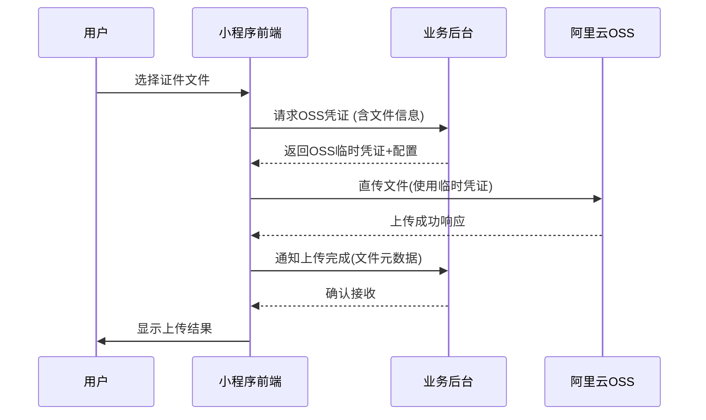

# 旭钦郢票务证件上传系统
软件需求规格说明书

| 文档信息 | 说明 |
|---------|------|
| 文档标题 | 旭钦郢票务证件上传系统软件需求规格说明书 |
| 版本号 | V2.0 |
| 状态 | 正式发布 |
| 发布日期 | 2025-07-01 |
| 文档维护 | 旭钦郢票务技术团队 |
| 系统依赖 | 后台API服务 v3.1+ |

## 文档修订历史

| 版本号 | 修订日期 | 修订说明 | 修订人 |
|--------|----------|----------|--------|
| V2.0 | 2025-07-01 | 完善系统功能，增加安全措施 | 技术团队 |
| V1.0 | - | 初始版本 | - |

## 目录

- [1. 引言](#1-引言)
  - [1.1 编写目的](#11-编写目的)
  - [1.2 系统定位](#12-系统定位)
  - [1.3 术语表](#13-术语表)
- [2. 系统功能需求](#2-系统功能需求)
  - [2.1 用户认证](#21-用户认证)
  - [2.2 文件上传](#22-文件上传)
  - [2.3 文件管理](#23-文件管理)
  - [2.4 安全机制](#24-安全机制)
- [3. 系统接口规范](#3-系统接口规范)
- [4. 非功能需求](#4-非功能需求)
- [5. 系统架构](#5-系统架构)
- [6. 测试需求](#6-测试需求)

## 1. 引言

### 1.1 编写目的
本文档旨在详细说明旭钦郢票务证件上传系统的功能需求和技术规范，为系统开发和测试提供依据。

### 1.2 系统定位
证件上传系统是旭钦郢票务公司小程序的核心模块，为用户提供安全可靠的证件文件上传功能。系统采用阿里云OSS作为存储方案，通过后台API进行用户认证和临时凭证管理。

### 1.3 术语表

| 术语 | 说明 |
|------|------|
| OSS | 阿里云对象存储服务 |
| STS | 阿里云临时访问凭证服务 |
| Token | 用户身份验证令牌 |

## 2. 系统功能需求

### 2.1 用户认证

#### 2.1.1 认证机制
- 用户登录通过后台API验证，不对外开放注册
- 前端传递token或用户标识到后台验证合法性
- 登录状态持久化存储（localStorage）

#### 2.1.2 登出功能
- 清除本地用户凭证
- 通知后台注销会话

### 2.2 文件上传

#### 2.2.1 上传流程


#### 2.2.2 文件限制
- 单次最大上传数：5个文件
- 单个文件大小：≤5MB
- 支持格式：图片格式(jpg/png)、PDF

### 2.3 文件管理

#### 2.3.1 文件展示
- 显示OSS文件名和原始文件名
- 实时展示上传状态和进度
- 支持文件预览（图片/PDF）

#### 2.3.2 文件操作
- 删除文件（调用后台API物理删除）
- 支持批量上传和删除

### 2.4 安全机制

#### 2.4.1 临时凭证
- 基于阿里云STS服务生成临时访问凭证
- 权限范围：仅允许上传到指定目录
- 凭证有效期：1小时（可配置）

#### 2.4.2 数据隔离
- 采用`user/{userId}/`格式进行目录隔离
- 文件名使用UUID+时间戳生成，防止冲突和猜测

## 3. 系统接口规范

### 3.1 获取OSS凭证
- **接口**：POST /api/get-oss-credentials
- **参数**：
```json
{
  "userId": "123",
  "fileCount": 2,
  "fileTypes": ["image/jpeg", "application/pdf"]
}
```
- **响应**：
```json
{
  "code": 0,
  "data": {
    "credentials": {
      "accessKeyId": "STS...",
      "accessKeySecret": "...",
      "stsToken": "...",
      "expiration": "2023-07-01T12:00:00Z"
    },
    "ossConfig": {
      "region": "oss-cn-shanghai",
      "bucket": "xuqinying-docs",
      "uploadPath": "user/123/20230630/"
    }
  }
}
```

### 3.2 确认上传
- **接口**：POST /api/confirm-upload
- **参数**：
```json
{
  "userId": "123",
  "files": [{
    "ossPath": "user/123/20230630/a1b2c3.jpg",
    "originalName": "id_card.jpg",
    "size": 245760,
    "type": "image/jpeg"
  }]
}
```

### 3.3 删除文件
- **接口**：POST /api/delete-file
- **参数**：
```json
{
  "userId": "123",
  "filePath": "user/123/20230630/a1b2c3.jpg"
}
```

## 4. 非功能需求

### 4.1 性能需求
- 上传响应时间：≤3秒（5MB以内文件）
- 并发支持：≥100用户同时上传
- 日均上传量：≥10000次

### 4.2 安全需求
- 所有接口强制HTTPS
- API请求需包含签名验证
- 定期清理过期文件和临时凭证

### 4.3 可用性需求
- 系统可用性：≥99.9%
- 支持断点续传
- 网络异常自动重试

## 5. 系统架构

```
  +------------+       +-------------+       +---------------+
  | 微信小程序  | <---> | 业务后台API  | <---> | 阿里云OSS存储  |
  +------------+       +-------------+       +---------------+
         │                    │
         │                    ├───────────> 阿里云STS服务
         │                    │
         │                    └───────────> 数据库(文件元数据)
         │
         └──────────────────> CDN加速(可选)
```

### 5.1 数据存储
```sql
CREATE TABLE user_documents (
  id BIGINT AUTO_INCREMENT,
  user_id VARCHAR(32) NOT NULL,
  oss_path VARCHAR(255) NOT NULL,
  original_name VARCHAR(255) NOT NULL,
  file_size INT NOT NULL,
  file_type VARCHAR(50) NOT NULL,
  upload_time DATETIME DEFAULT CURRENT_TIMESTAMP,
  PRIMARY KEY (id),
  INDEX idx_user (user_id)
);
```

## 6. 测试需求

### 6.1 功能测试
1. 上传流程测试
   - OSS凭证获取测试
   - 文件上传测试（含分片上传）
   - 上传状态同步测试

### 6.2 安全测试
1. 权限验证
   - 用户认证测试
   - 跨用户访问测试
   - 凭证有效期测试

### 6.3 性能测试
1. 并发上传测试
2. 网络异常恢复测试
3. 大文件上传测试

---

## 附录A：错误码说明

| 错误码 | 说明 | 处理建议 |
|--------|------|----------|
| 401 | 未授权访问 | 重新登录 |
| 403 | 权限不足 | 检查用户权限 |
| 413 | 文件过大 | 压缩文件或分片上传 |
| 415 | 不支持的文件类型 | 检查文件格式 |

## 附录B：状态码定义

| 状态码 | 说明 |
|--------|------|
| 0 | 成功 |
| 1001 | 参数错误 |
| 1002 | 系统错误 |
| 2001 | 上传失败 |
| 2002 | 文件不存在 |